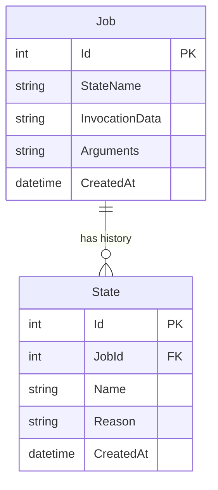

# Project Design

## 1. System Architecture

```mermaid
flowchart TD
    Client[Client / API Consumer] -->|REST API| API[Backend API (.NET 6)]
    subgraph Backend Services
        API -->|Enqueue/Schedule| HangfireClient[Hangfire Client]
        HangfireClient -->|Save Job| DB[(MySQL Database)]
        HangfireServer[Hangfire Server] -->|Poll/Fetch Job| DB
        HangfireServer -->|Execute| TaskService[Task Execution Service]
    end
    API -->|View Dashboard| Dashboard[Hangfire Dashboard]
    Dashboard -->|Read State| DB
```

## 2. ER Diagram (Hangfire Schema + Custom)

Hangfire manages its own schema (`Hash`, `Job`, `List`, `Set`, `State`, `Counter`, `AggregatedCounter`, `Server`).
We will treat the Hangfire tables as infrastructure.



## 3. API Endpoints

### Job Controller (`/api/jobs`)

| Method | Path | Description | Params |
| :--- | :--- | :--- | :--- |
| POST | `/api/jobs/fire-and-forget` | Trigger an immediate job | `{ "taskType": "string", "payload": "string" }` |
| POST | `/api/jobs/delayed` | Schedule a job for later | `{ "taskType": "string", "payload": "string", "delaySeconds": int }` |
| POST | `/api/jobs/recurring` | Create/Update recurring job | `{ "jobId": "string", "cronExpression": "string", "taskType": "string", "payload": "string" }` |
| DELETE | `/api/jobs/recurring/{jobId}` | Remove a recurring job | `jobId` |

## 4. UI/UX Specifications

Since this is a backend-focused project, the UI is primarily the **Hangfire Dashboard**.

- **URL**: `/hangfire`
- **Authentication**: Basic Authentication (User/Pass configured in appsettings).
- **Style**: Standard Hangfire UI.

## 5. Technology Stack
- **Framework**: .NET 6 (Compatible with available SDK)
- **Database**: MySQL 8.0
- **Job Scheduler**: Hangfire.AspNetCore + Hangfire.MySqlStorage
- **Logging**: Serilog
